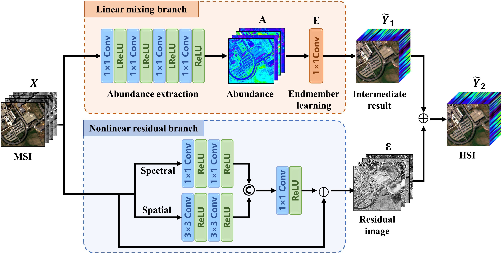

# Spectral-Mixing-Theory-Based-Double-Branch-Network-for-Spectral-Super-Resolution
Implementation for: "Spectral Mixing Theory-Based Double-Branch Network for Spectral Super-Resolution". More specifically, it is detailed as follow.

In this article, we employed two simulated datasets and a real MSI-HSI dataset observed by ZY1-02D satellites.
For the simulated datasets of Pavia University and Indian Pines, you can download the data from the following links [Hyperspectral Remote Sensing Scenes - Grupo de Inteligencia Computacional (GIC) (ehu.eus)](https://www.ehu.eus/ccwintco/index.php/Hyperspectral_Remote_Sensing_Scenes)
The ZY1-02D dataset are available 

The code will soon be accessible.
